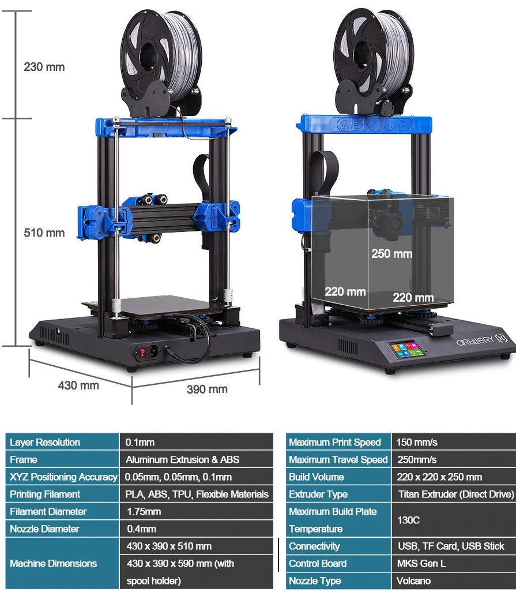

# Artillery Genius Configurations

  

# Product Info

<table>
  <tr>
    <th>Build Volume</th>
    <td>220x220x250mm</td>
  </tr>
  <tr>
    <th>Control Board</th>
    <td>MKS Gen L 8-bit - ATMEGA2560; 16Mhz 
    <small>
    <a href="https://github.com/makerbase-mks/MKS-GEN_L/tree/master/hardware/MKS%20Gen_L%20V1.0_008">MakerBase MKS Github</a> | 
    <a href="artefacts/MKS Gen_L V1.0_008 PIN.pdf">PIN layout</a></small>
    </td>
  </tr>
  <tr>
    <th>Extruder Type</th>
    <td>Titan Aero (Direct Drive) Clone  <small><a href="https://e3d-online.com/products/titan-aero">E3D Titan Aero</a> | <a href="https://aus3d.com.au/products/e3d-titan-aero">Aus3D E3D Titan Aero</a></smalL> </td>
  </tr>
  <tr>
    <th>Nozzle Type</th>
    <td>E3D Volcano</td>
  </tr>
</table>

# Modifications

## Klipper

The Artillery Genius runs on Klipper.

## BLTouch Integration

