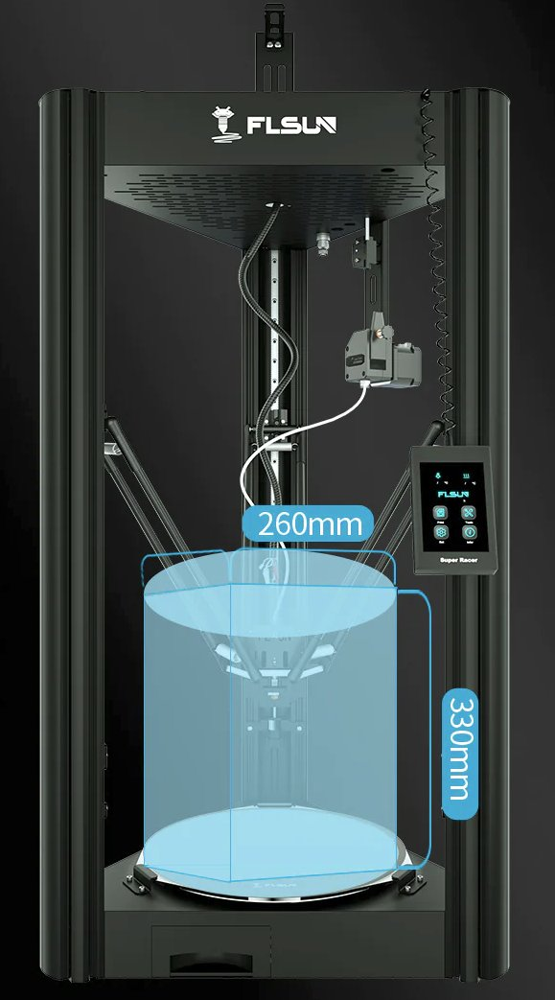

# FLSun Super Racer Klipper Configuration
Both FLSun Super Racers (as of May 2023+) now run on Klipper and utilise a MKS Robin Nano v3.

My initial FLSun Super Racer came with the SKR v1.3 Clone but was replaced with the MKS Nano v3 after some modifications to the chasis to accomodate/fit it in. This was ideally to simplify the Klipper installations.
Setting up your FLSun Super Racer with Klipper and modifications (like the FYSETC Input Shaper) are well documented (in French) on [Klipper FLSun Super Racer](https://guilouz.github.io/Klipper-Flsun-Super-Racer/configurations/adxl/) by [@Guilouz](https://github.com/Guilouz).

Cura Profiles were authored by myself & @Guilouz on the initial FLSun Super Racer SKR batch.

## Acknowledgements

* Based on the excellent work by [@Guilouz](https://github.com/Guilouz/Klipper-Flsun-Super-Racer).
* [@cupsster](https://github.com/cupsster/FLSUN-SR---Klipper-Config/tree/master) -  Klipper
* [@rootiest](https://github.com/rootiest/zippy-klipper_config) - Voron tweaks

# Product Info

<table>
  <tr>
    <th>Build Volume</th>
    <td>260x260x330mm</td>
  </tr>
  <tr>
    <th>Control Board</th>
    <td>
    
MKS Robin Nano v3 
    <small>
    <a href="https://www.makerbase.store/products/makerbase-mks-robin-nano-v3">Product Page</a> | 
    <a href="https://github.com/makerbase-mks/MKS-Robin-Nano-V3.X">Github</a> | 
    <a href="./artefacts/mks-robin-nano-v3-pins.jpg">PIN layout</a></small>
    

    
BigTreeTech SKR v1.3 
    <small>
    <a href="https://www.aliexpress.com/item/32981807406.html?gatewayAdapt=Msite2Pc">Product Page</a> | 
    <a href="https://github.com/bigtreetech/BIGTREETECH-SKR-V1.3">Github</a> | 
    <a href="./artefacts/skr-v1.3-pins.jpg">PIN layout</a></small>
    

    </td>
  </tr>
  <tr>
    <th>Extruder Type</th>
    <td>Bondtech BMG® Extruder Clone  <small><a href="https://www.aliexpress.com/item/1005003092239261.html">AliExpress: TriangleLabs</a> | <a href="https://www.bondtech.se/product/bmg-extruder/">Bondtech BMG Extruder</a></smalL> </td>
  </tr>
  <tr>
    <th>Nozzle Type</th>
    <td>E3D Volcano</td>
  </tr>
</table>

# Modifications
First and foremost the stock extruder (Bondtech BMG Clone) is rubbish and should be replaced with the [authentic BMG extruder](https://www.bondtech.se/product/bmg-extruder/) or a very good [clone by TriangleLabs](https://www.aliexpress.com/item/1005003092239261.html?).

* [Capricorn 1.75mm Bowden Tube](https://www.captubes.com/shop/#!/2-Meters-XS-Low-Friction-1-75mm-Bowden-Tubing/p/82434216/category=23214267) - also available on Amazon.
* Dual Ball Bearing 5015 24v Radial Fans - like 5015 GDSTIME models.
* Bi-Metal heatbreak
* Volcano Heatblock
* E3D Volcano Nozzle - 0.4mm Hardened Steel
* [Meanwell LRS350-2](https://www.meanwell.com/productPdf.aspx?i=459) PSU - bought from [Mouser](https://au.mouser.com/ProductDetail/MEAN-WELL/LRS-350-24?qs=ah3jBNVE1PT%252BkwLcackrGA%3D%3D)
* [FYSETC Input Shaper](https://www.fysetc.com/products/fysetc-portable-input-shaper-with-rp2040-upgraded-3d-printer-parts-support-klipper-for-voron-2-4-0-1-trident) - from the Voron, but with a RP2040, makes this so easy within Klipper. (see [instructions](https://guilouz.github.io/Klipper-Flsun-Super-Racer/configurations/adxl/))

## Printer

  

